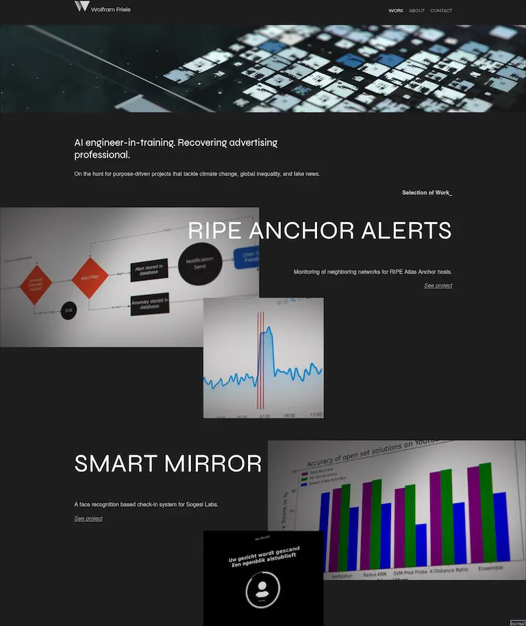

+++
title = "From Flask to Zola: the evolution of this website"
description = "Why did I change the website again, and why did I go from a dynamic python based setup to a static much simpler setup."
date = 2024-01-18
+++

After thinking about it and putting it off for a while, I finaly completly overhauled my website. In this first blog I want to share my goals for this website, why I ended up changing most of the design, and lastly what changed in building it trough all the different iterations.

## What are my goals with this website?

### Share things that I'm excited and curious about

I have been getting a lot of enjoyment out of reading other peoples blogs, and I would like to contribute to the ever growing mountain of interresting information called the internet.
The stuff I'll be writing about will probably range from web development to tinkering with split keyboards [^1], and from [long distance self supported bike racing](https://www.adventurebikeracing.com/ratngx/) to building DIY furniture.

### Reinforce what I'm learning by writing about it

For my studies I need to write about what I'm learning as a way to share this with other students, but it also helps me with improving my own understanding. Since I am nearing the end of my studies, this blog can serve as a way to keep that method alive. And who knows maybe at some point other people will find value in the stuff I'm learning?

There are some indirect goals that I'm working on aswell; I want to get better at delivering the high value features / tasks before I dive into the details of a project. This website is a great way to work on that skill. So my goal is to incrementally improve the site instead of doing one big update.

## Why did I want to change the website again?

The main reason for completly redoing the design is that previous iterations of the website where always purely project focussed. My background is in [3D-animation](https://vimeo.com/261704101), and portfolio websites with finished projects are the defacto standard in that industry.

But now that I'm switching my career to development I have found this to work poorly for me. The last couple of projects I worked on took the better part of a year, when I try to capture them on a project page it tends to end up more as a brief overview, and therefore kind of boring. I hope that changing the format to a blog allows me to dig into cool topics further, they can sometimes be related to the bigger projects, but I also hope to write about smaller passion projects and even just other things I find interresting. 

The second reason is that, while my previous website looked pretty cool (if I may say so myself), after reading [how to build a solar website](https://solar.lowtechmagazine.com/2018/09/how-to-build-a-low-tech-website/), I realized it was to image heavy for my current goals. This lead to relatively bad performance; does performance matter on a site with no visitors? Probably not, but optimizing this website is still a great way for me to learn more about web performance. And reading posts from about [the cost of Javascript frameworks](https://timkadlec.com/remembers/2020-04-21-the-cost-of-javascript-frameworks/) and [the ethics of performance](https://timkadlec.com/remembers/2019-01-09-the-ethics-of-performance/) I convinced myself to start afresh!

## The previous iterations of my website

I have had my domain since 2012 and the first wayback machine snapshots show up in 2013. For most of this period I ran various wordpress themes with some custom CSS, this was all fine and dandy for just showing projects.

### Flask

When I started at [the university of applied sciences](https://www.hu.nl/voltijd-opleidingen/open-ict), the first project we were supposed to build was a personal website. Since my goal at the time was getting into machine learning, the logical choice was to learn Python. I looked into python webframeworks and settled on [Flask](https://flask.palletsprojects.com/en/3.0.x/), because it seemed light and I found a great tutorial by [Miguel Grinberg](https://blog.miguelgrinberg.com/post/the-flask-mega-tutorial-part-i-hello-world). From a learning perspective this was a great choice; I learned about running and Deploying python applications, databases and database migrations, templating languages, and even improved my understandig of HTML because I designed the website with a relatively complicated grid. It was a great time!

The problem with [this setup](https://github.com/Wolframfriele/Portfolio_website_flask) was that it did not need to be dynamic, I was simply serving pages that would change maybe once every half year. Because it required a VM to run and a separate database, it would be relatively expensive to host longterm, and seemed to be overly complex for the problem I was trying to solve.  

### Svelte

The following project I worked on was a reservation system build with a combination of [Django](https://www.djangoproject.com/) and [Vue.js](https://vuejs.org/). My role was more on the front-end, and I learned about building with components. At the time I heard good things about [Svelte](https://svelte.dev/), and figured I could learn about it while also making [my website static](https://github.com/Wolframfriele/wolframfriele.github.io/tree/development), using sapper. To update content I would simply change the content of some json files, build the website, and push the resulting export to the main branch. While this worked great, for updating projects, I wanted something better for blogging.

### Zola

The right tool for my requirements is a static website generator, and so I have finally landed on [Zola](https://www.getzola.org/). It has support for codeblocks, a templating language that is very similar to Jinja, and is written in Rust so it must be blazingly fast.

So far it has been an absolute joy to work with, want Reading time? There's a [variable build in](https://www.getzola.org/documentation/templates/pages-sections/) for that. Codeblocks? Just [enable it in the configuration](https://www.getzola.org/documentation/content/syntax-highlighting/). Footnotes and tables also worked out of the box. As I build out this site further, I'll update with my experience and other tricks that I find.

---

[^1] As I'm writing this, the new batteries to make my keyboard wireless and a Raspberry Pi 5 have just arrived. 

