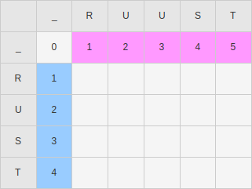
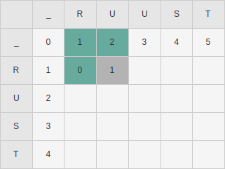
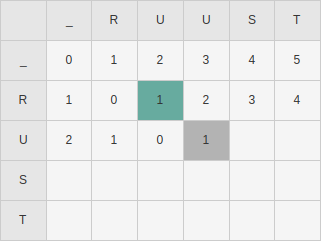

+++
title = "Typing Faster: Single word autocorrect"
description = "Can typing speed be improved without completely re-learning a new system? This post lay's out the ideas for a project I have been tinkering around with in my free time."
date = 2024-04-04
draft = true
+++

## Spellchecking

[Historically](https://www.youtube.com/watch?v=d-Eq6x1yssU) one of the earlier methods that gave corrections for misspelled words was based around a metric called _edit distance_. This is simply the amount of edit operations that it takes to go from one word to another. For example the edit distance between _RUUST_ and _RUST_ is 1, simply delete one _U_. There are variations of edit distance, with different operations that are allowed. But for this post I'll focus on the Levenshtein distance (insert, delete, substitute).

This algorithm uses [dynamic programming](https://www.youtube.com/watch?v=Hdr64lKQ3e4), the process can be visualized in a table with the letters of the source word as the columns and the letters of the target word as the rows. The values in this table are the edit distance to go from the source substring at the top, to the target substring.

The first row (magenta) is very simple to fill, it can be read as, how many operations does it take to go from the substrings of _RUUST_ to an empty string. So going from _R_ to _empty string_ takes one deletion operation, going from _RU_ to _empty string_ takes 2 deletion operations and so fourth. 

The first column (blue) is similarly easy, except its going from _empty string_ to the word _RUST_, by insertion operations. 

Each row is filled from left to right, and for each substring you mark down the edit distance between those sub strings. So from _R_ to _R_ has an edit distance of 0, then from _RU_ to _R_ has an edit distance of 1.

To calculate this, you look at last letters in both substrings in this example _U_ and _R_, and if they are not the same it will take one operation. To find the cheapest path to get to the current substring, check the minimum value of the cells highlighted in green. 

When the letters are the same you only look at one position (green), and take the same edit distance (not adding 1). 

After filling in the entire table, you can simply look at the bottom right value, in this case 1. This is the edit distance between the input string and the target string.

